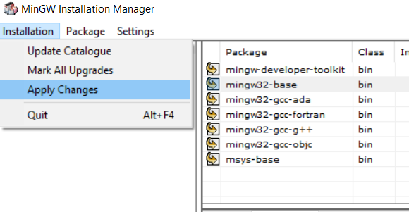

# CP-Notebook

# Setup C++ with Visual Studio Code

- Tải <a href ="https://sourceforge.net/projects/mingw/">SourceForge-Mingw</a>
- Chạy file mingw-get-setup.exe vừa tải về
- Chọn **mark for installation**
  
- Installation -> Apply Changes
  
- Thêm đường dẫn vào Environment Variables